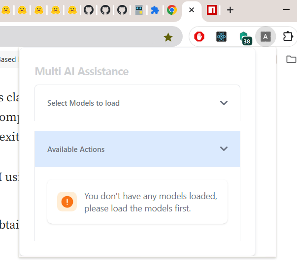
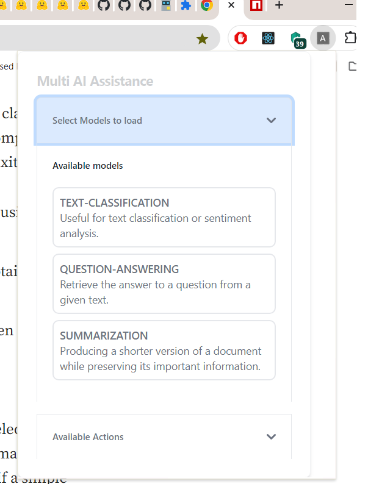
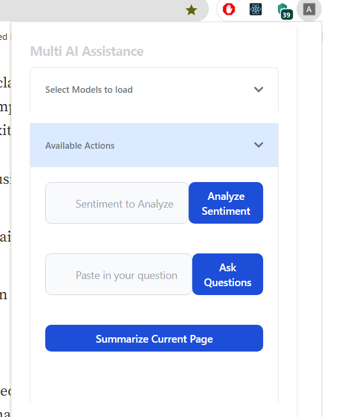

# React + AI Google Extension

This is a simple POC for a Chrome extension that shows how to use LLM on the Web locally. It leverages `Transformer.js` which is a State-of-the-art machine learning for the web and let's us run models directly on the browser.

## Architecture Overview

- This Chrome extension uses inbuilt Chrome APIs to interact with tabs and pages along with React for building the UI.
- The extension has following flow:
  - When initially loaded it, lets the user select what models to cache locally.
  - There are only 3 options available for now.
    - `Sentiment Analyses` - Analyses the provided text.
    - `Summarization` - Summarizes the current open tab content.
    - `Question Answering` - Answers question based on the current open tab content.
  - Once the user selects the model, the model gets loaded and locally cached.
  - Now the user can interact with the model.

### Browser Extension Config

- I assume you know how to load a local extension in Chrome, if not please follow this guide here: [Load Local Extension](https://developer.chrome.com/docs/extensions/get-started/tutorial/hello-world)
- The main crux here is the `manifest` file that makes sure we have right permissions and access for using the chrome API. Here are the necessary configs for manifest file, the path here are pointing to the `dist` folder.

  ```json
  {
    "permissions": ["scripting", "activeTab", "tabs", "storage"],
    "background": {
      "service_worker": "./service-worker.js",
      "type": "module"
    },
    "host_permissions": ["https://*/*"],
    "action": {
      "default_popup": "./src/components/popup/popup.html",
      "default_title": "AI Extension"
    },
    "content_security_policy": {
      "extension_pages": "script-src 'self' 'wasm-unsafe-eval'; object-src 'self';",
      "sandbox": "sandbox allow-scripts allow-forms allow-popups allow-modals; script-src 'self' 'unsafe-inline' 'unsafe-eval'; child-src 'self';"
    },
    "content_scripts": [
      {
        "matches": ["<all_urls>"],
        "js": ["./content.js"]
      }
    ]
  }
  ```

### The UI

- For building the extensions UI I have used React, Typescript and Tailwind.
- And in order to streamline the things I have used `Vite` to scaffold the project.
- I have configured `vite` to output separate assets as the extension is not a bundled app. See how we are explicitly defining separate entry points.
- Here is the modified config

  ```ts
    import { defineConfig } from "vite";
    import { resolve } from "path";
    import react from "@vitejs/plugin-react";
    import copy from "rollup-plugin-copy";

    export default defineConfig({
        plugins: [react()],
        build: {
        rollupOptions: {
            plugins: [
                copy({
                targets: [{ src: "./manifest.json", dest: "dist/" }],
                }),
            ],
            input: {
                popup: resolve(**dirname, "./src/components/popup/popup.html"),
                "service-worker": resolve(**dirname, "./src/worker/service-worker.js"),
                content: resolve(\_\_dirname, "./src/content.ts"),
            },
            output: {
                dir: "dist",
                entryFileNames: "[name].js",
            },
        },
    });
  ```

- The UI is simple which let's user selects a Model, to load and than use it.
- The loaded model stays in the User's cache and the user can interact with that even in offline mode.

### Loading LLM in Web

- We will be using `@xenova/transformers` package to do the heavy lifting of loading and calling the model in Web.
- We can use two ways to load and interact with the models.

  1. `Web Worker` - This is the best approach if we are building Applications that run in browser, as this takes away the work from main thread.

     1. For loading the model we will create a `web-worker.ts` file that will house logic to load LLM in browser.
     2. Here is a simple example:

        ```ts
        import { pipeline, env, PipelineType } from "@xenova/transformers";
        // Skip initial check for local models, since we are not loading any local models.
        env.allowLocalModels = false;

        // Due to a bug in onnxruntime-web, we must disable multithreading for now.
        // See https://github.com/microsoft/onnxruntime/issues/14445 for more information.
        env.backends.onnx.wasm.numThreads = 1;

        type PipelineModel = ReturnType<typeof pipeline>;

        class PipelineSingleton {
          // define the task we want to use
          static task = "text-classification" as PipelineType;
          // define the model for that task
          static model =
            "Xenova/distilbert-base-uncased-finetuned-sst-2-english";
          static instance: null | PipelineModel = null;

          // this will create a single instance of the loaded model, and we don't need to laod it again
          static async getInstance(progress_callback: Function | undefined) {
            if (this.instance === null) {
              this.instance = pipeline(this.task, this.model, {
                // this is the callback function to track loading progress
                progress_callback,
              });
            }
            return this.instance;
          }
        }

        // Listen for messages from the main thread
        self.addEventListener("message", async (event) => {
          console.log("Web worker received", event);
          // Retrieve the classification pipeline. When called for the first time,
          // this will load the pipeline and save it for future use.
          const classifier = await PipelineSingleton.getInstance(() => {
            // We also add a progress callback to the pipeline so that we can
            // track model loading.
            // console.log(x);
            // self.postMessage(x);
          });

          // eslint-disable-next-line @typescript-eslint/ban-ts-comment
          // @ts-ignore
          const output = await classifier(event.data.text);

          // Send the output back to the main thread
          self.postMessage({
            status: "complete",
            output: output,
          });

          return true;
        });
        ```

     3. Now to consume it we just create a instance of web worker pointing to this file.

        ```ts
        const App: FC<{}> = () => {
          const worker = useRef<Worker | undefined>(undefined);

          useEffect(() => {
            // create instnce of the worker
            worker.current = new Worker(
              new URL("../../worker/web-worker.ts", import.meta.url),
              {
                name: "worker",
              }
            );
            // here we post a message to the web worker
            worker.current.postMessage({ text: "I am happy" });

            // here we listem for any messages coming from web worker
            worker.current.onmessage = function (event) {
              console.log("Recieved from Web worker", event.data.output);
              alert(
                `Hello from WEB WORKER ${event.data.status} -- ${event.data.output[0].label}`
              );
            };
          }, []);

          return <div>Tets</div>;
        };
        ```

  2. `Service Worker` - Is another way to offload task from main thread and do any heavy processing needed. We will be using this since its gels well with the Extension flow and is simpler to consume. To create and consume a simple service worker in Extension we need to do the following:

     1. Create a `service-worker.js` file, that houses logic to load and run llm.

        ```js
        import { pipeline, env, PipelineType } from "@xenova/transformers";
        import { AVAILABLE_MODELS } from "../utils/data";
        import { getInnerHTMLFromPage } from "../utils/utils";

        if (
          typeof ServiceWorkerGlobalScope !== "undefined" &&
          self instanceof ServiceWorkerGlobalScope
        ) {
          // Skip initial check for local models, since we are not loading any local models.
          env.allowLocalModels = false;

          // Due to a bug in onnxruntime-web, we must disable multithreading for now.
          // See https://github.com/microsoft/onnxruntime/issues/14445 for more information.
          env.backends.onnx.wasm.numThreads = 1;

          class PipelineSingleton {
            static instance = {
              "text-classification": null,
              "question-answering": null,
              summarization: null,
            };

            static async getInstance(task, progress_callback) {
              if (this.instance[task] === null) {
                console.log("create new Instance", task);
                const item = AVAILABLE_MODELS.find((el) => el.task == task);
                const model = item.model;
                this.instance[task] = pipeline(task, model, {
                  progress_callback,
                });
              }

              return this.instance[task];
            }
          }

          // Listen for messages from the UI, process it, and send the result back.
          chrome.runtime.onMessage.addListener(
            (message, sender, sendResponse) => {
              // Run model prediction asynchronously
              (async function () {
                // Run model prediction
                let result = await model(message.query);
                console.log("Service worker result", result);
                //  Send response back t
                sendResponse(result);
              })();
              // return true to indicate we will send a response asynchronously
              // see https://stackoverflow.com/a/46628145 for more information
              return true;
            }
          );
        }
        ```

     2. Now to consume it in React code we can just call:

        ```js
        chrome.runtime.sendMessage("What a dull day", (response: any) => {
          console.log("Resonse from Service worker", response);
          alert(`Hello from Service WORKER ${response}`);
        });
        ```

     3. The last and most crucial part is tell our Extension to load this service worker by adding the `background` property to the manifest file. The path here is for the `dist` folder.

        ```json
        "background": {
            "service_worker": "./service-worker.js",
            "type": "module"
        },
        ```

### Local Development

- Run the following commands:
- `npm run install`
- `nom run build`
- For now have to manually copy the `manifest.josn` file to the `dist` folder.
- Now u can take the `dist` folder and load it as local extension.

### UI






